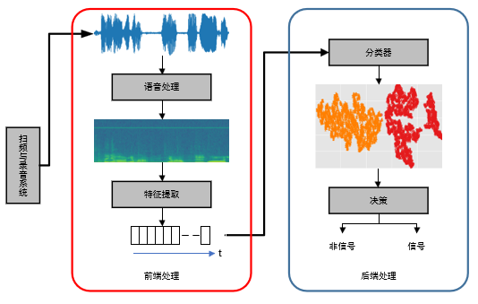
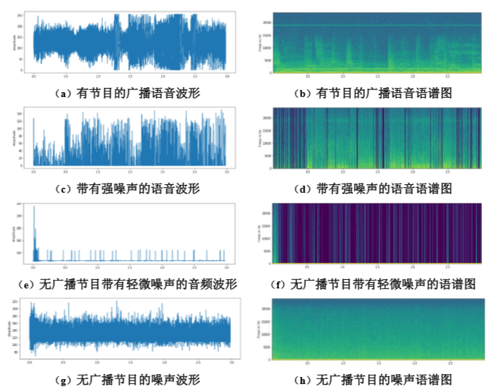
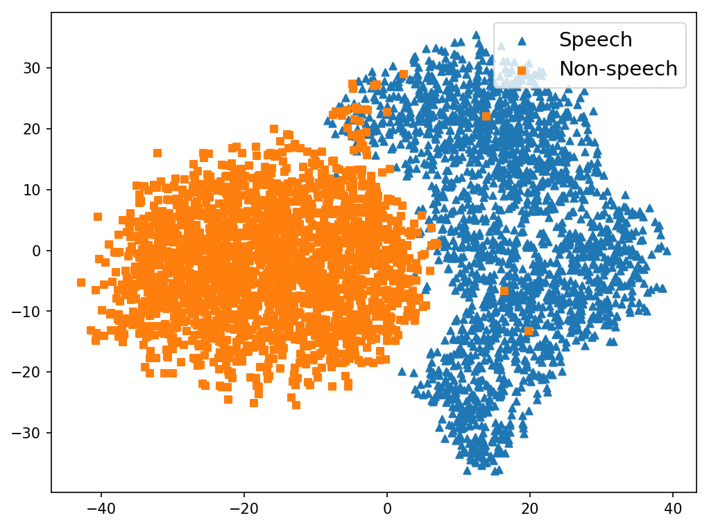
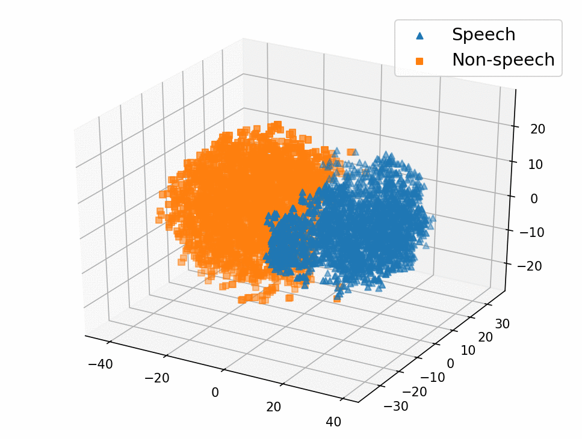

# FM_Radio_Detecting_329

**项目介绍**:本项目实现对调频广播频段的信号的检测,并对是有广播节目的频点实现音频文件转文本。

**调频广播信号检测项目的目录结构**:

    ├── 01.getFeatures
    |   |—— features               // 保存提取后的特征
    |   |—— makeLogFbanks.py       // 提取音频声学特征
    |   └── run.sh                 // sh脚本，用于执行查找文件，运行提取特征的 *.py 文件
    ├── 02.trainModel         
    │   ├── model                  // 训练模型后的保存文件，训练好的模型和测试数据的可视化
    │   └── train_cnn     
    |       ├── net_component.py   // 定义神经网络的模型
    |       ├── make_torchdata.py  // 准备网络的输入数据 
    |       ├── train.py           // 训练模型
    |       └── run.sh             // sh脚本，用于执行查找文件，运行 train.py 文件，开始训练  
    ├── 03.inference 
    |   ├── result                 // 测试数据的可视化   
    |   ├── net_component.py       // 定义神经网络的模型
    |   ├── make_torchdata.py      // 准备网络的输入数据 
    |   ├── inference.py           // 加载模型进行测试
    |   └── run.sh                 // sh脚本，用于执行查找文件，运行 inference.py 文件，开始测试 
    ├── 04.inference 
    |   ├── feature                // 保存提取后的特征   
    |   ├── net_component.py       // 定义神经网络的模型
    |   ├── make_torchdata.py      // 准备网络的输入数据 
    |   └── fm_predict.py          // 对FM的音频文件进行检测
    ├── 05.S2T_Baidu 
    |   ├── speech_signal          // 保存 04 中检测为speech的文件   
    |   └── Baidu_speech2text.py   // 对speech_signal中的音频文件进行语音转文本
    ├── data_fm                    // FM频段的示例
    |—— dataset                    // 训练数据
    |—— doc                        
    |── README.md
    └── requirements.txt           
  
**调频广播检测系统框图**：

## Dependencies（依赖环境）

使用 **python3.6** + **Pytorch** + **baidu-aip** 开发，其中使用到的依赖包如下：

* numpy==1.15.1, scipy==1.1.0, matplotlib==2.2.3, tqdm==4.26.0
* python-speech-features==0.6, sox==1.3.3
* scikit-learn==0.19.2, scikits.talkbox==0.2.5 
* torch==0.4.1, torchvision==0.2.1
* baidu-aip==2.2.13.0

Installation（安装依赖）: pip install -r requirements.txt

## Dataset（数据集）

用于训练和测试的数据集

数据集 | 音频条数 |  音频总时长|
 :-: | :-: | :-:
信号    | 10445（句） | 8.7（小时） |
非信号  | 10451（句）|  8.7（小时）|

数据集（dataset）划分按7:2:1划分为训练集（train data）、开发集（dev data）、测试集（test data）。

其中部分数据的样本如下图所示：

## Audio features extracted（音频特征提取）
FBank、MFCC、SDC、PLP、Spectrum等特征

## Training and Evaluation（训练和测试）

**使用CNN来实现信号检测，其结构如下所示**：

      FM_DeepModel(
      (layer1): Sequential(
        (0): Conv2d(1, 16, kernel_size=(5, 11), stride=(2, 5))
        (1): BatchNorm2d(16, eps=1e-05, momentum=0.1, affine=True, track_running_stats=True)
        (2): ReLU()
      )
      (layer2): Sequential(
        (0): Conv2d(16, 32, kernel_size=(5, 11), stride=(2, 5))
        (1): BatchNorm2d(32, eps=1e-05, momentum=0.1, affine=True, track_running_stats=True)
        (2): ReLU()
      )
      (layer3): Sequential(
        (0): Conv2d(32, 64, kernel_size=(3, 3), stride=(2, 2))
        (1): BatchNorm2d(64, eps=1e-05, momentum=0.1, affine=True, track_running_stats=True)
        (2): ReLU()
      )
      (layer4): Sequential(
        (0): Conv2d(64, 128, kernel_size=(3, 3), stride=(1, 1))
        (1): BatchNorm2d(128, eps=1e-05, momentum=0.1, affine=True, track_running_stats=True)
        (2): ReLU()
      )
      (fc1): Linear(in_features=256, out_features=256, bias=True)
      (preluip): PReLU(num_parameters=1)
      (fc2): Linear(in_features=256, out_features=2, bias=True)
    )

### Training（训练）

**参数**：

    num_classes = 2
    num_epochs = 10
    batch_size = 120
    learning_rate = 0.001
        
使用的优化方法：

    criterion = nn.CrossEntropyLoss()
    optimizer = torch.optim.Adam(model.parameters(), lr=learning_rate)

### Evaluate（测试）
测试时，第1个epoch时模型达到了 **99.53%** 的准确率，模型最后达到 **99.83%** 的准确率。

使用 sklearn.manifold 中的 t-SNE 对 fc1 的输出进行可视化：

    tsne = manifold.TSNE(n_components=3, init='pca', random_state=0)
    X_tsne = tsne.fit_transform(last_embedding)

## Inference（推断-再次测试）
使用下面的代码加载 02 中保存的模型，用来进行测试。注意GPU和CPU的切换。

    # model = torch.load('../02.trainModel/model/model_speech_noise_FBank_9.pth')
    model = torch.load('../02.trainModel/model/model_speech_noise_FBank_9.pth', map_location='cpu')

## FM Predicting（FM 频段广播信号检测）
与上一步相同，加载模型，对文件夹 data_fm 里的文件进行预测，识别出那些是信号，并将是信号的音频文件复制到 './05.S2T_Baidu/speech_signal' 中

    wavpath = '../data_fm/'
    datalist = 'data_list.txt'
    data_dir = "./features/LogFbank/"
    features_list = 'data_list_lfb.txt'

    result_dic = main(wavpath, datalist, data_dir, features_list)

    print('\nresult_dic: {}\n'.format(result_dic))

    list1 = sorted(result_dic.items(), key=lambda x: x[0])
    for idx, item in enumerate(list1):
        # print(item)
        item = list(item)
        print('频点： {}, 信号类别： {}, 是语音信号的概率值： {}\n'.format(item[0], item[1][0], item[1][1][1]))

        if item[1][0] == 1:
            oldpath = os.path.join('../data_fm/2019-01-02_16_05_36', str(item[0]) + 'MHz.wav')
            newpatn = os.path.join('../05.S2T_Baidu/speech_signal', str(item[0]) + 'MHz.wav')
            shutil.copy(oldpath, newpatn)
    
    输出：
         
    result_dic: {'91.1': [0, [0.99989545, 0.000104586456]], '91.2': [0, [0.99985456, 0.00014543523]], '91.3': [1, [9.564074e-05, 0.9999044]], '91.4': [0, [0.9998274, 0.00017262818]], '91.5': [0, [0.99983656, 0.00016338678]], '91.6': [0, [0.99991846, 8.157516e-05]], '91.7': [0, [0.9999403, 5.973239e-05]], '91.8': [1, [8.419428e-05, 0.99991584]], '91.9': [0, [0.99991417, 8.585341e-05]], '91': [0, [0.999445, 0.00055502006]], '92.0': [0, [0.99994874, 5.1229697e-05]], '92.1': [0, [0.999933, 6.6949084e-05]], '92.2': [0, [0.99823713, 0.0017629083]], '92.3': [1, [0.00011307727, 0.9998869]], '92.4': [0, [0.9987589, 0.0012410908]], '92.5': [1, [0.0065199328, 0.9934801]], '92.6': [0, [0.6229184, 0.3770815]], '92.7': [0, [0.9963198, 0.003680264]], '92.8': [0, [0.99994874, 5.121509e-05]], '92.9': [0, [0.9999486, 5.1379164e-05]], '93.0': [1, [9.812242e-05, 0.9999019]], '93.1': [0, [0.99992263, 7.738675e-05]], '93.2': [0, [0.999925, 7.494193e-05]], '93.3': [0, [0.9999572, 4.279748e-05]], '93.4': [0, [0.9999591, 4.0913146e-05]], '93.5': [1, [5.420044e-05, 0.99994576]], '93.6': [0, [0.99996376, 3.6231482e-05]], '93.7': [0, [0.98870856, 0.011291448]], '93.8': [0, [0.99995506, 4.488294e-05]], '93.9': [1, [0.41586345, 0.58413655]], '94.0': [0, [0.9999702, 2.980607e-05]], '94.1': [0, [0.99997425, 2.5763024e-05]], '94.2': [0, [0.9999751, 2.4864961e-05]], '94.3': [0, [0.9999701, 2.9962186e-05]], '94.4': [0, [0.9999715, 2.8433105e-05]], '94.5': [0, [0.9999267, 7.333816e-05]], '94.6': [0, [0.9999354, 6.4645574e-05]], '94.7': [0, [0.9999709, 2.9125797e-05]], '94.8': [0, [0.99996614, 3.3841497e-05]], '94.9': [1, [0.000115533556, 0.9998845]], '95.0': [0, [0.9999559, 4.4131415e-05]], '95.1': [0, [0.99996257, 3.7393598e-05]], '95.2': [0, [0.9999695, 3.0536925e-05]], '95.3': [0, [0.9999604, 3.9615235e-05]], '95.4': [1, [6.747619e-05, 0.9999325]], '95.5': [0, [0.9999349, 6.513262e-05]], '95.6': [0, [0.9999579, 4.210114e-05]], '95.7': [0, [0.9999645, 3.5511384e-05]], '95.8': [0, [0.999956, 4.392865e-05]], '95.9': [1, [0.00074070145, 0.9992593]], '96.0': [0, [0.9998944, 0.000105659245]]}

    频点： 91, 信号类别： 0, 是语音信号的概率值： 0.0005550200585275888
    
    频点： 91.1, 信号类别： 0, 是语音信号的概率值： 0.00010458645556354895
    
    频点： 91.2, 信号类别： 0, 是语音信号的概率值： 0.00014543523138854653
    
    频点： 91.3, 信号类别： 1, 是语音信号的概率值： 0.9999043941497803
    
    频点： 91.4, 信号类别： 0, 是语音信号的概率值： 0.00017262817709706724
    
    频点： 91.5, 信号类别： 0, 是语音信号的概率值： 0.00016338677960447967
    
    频点： 91.6, 信号类别： 0, 是语音信号的概率值： 8.157516276696697e-05
    
    频点： 91.7, 信号类别： 0, 是语音信号的概率值： 5.9732388763222843e-05
    
    频点： 91.8, 信号类别： 1, 是语音信号的概率值： 0.9999158382415771
    
    频点： 91.9, 信号类别： 0, 是语音信号的概率值： 8.58534112921916e-05
    
    频点： 92.0, 信号类别： 0, 是语音信号的概率值： 5.122969741933048e-05
    
    频点： 92.1, 信号类别： 0, 是语音信号的概率值： 6.694908370263875e-05
    
    频点： 92.2, 信号类别： 0, 是语音信号的概率值： 0.0017629083013162017
    
    频点： 92.3, 信号类别： 1, 是语音信号的概率值： 0.9998868703842163
    
    频点： 92.4, 信号类别： 0, 是语音信号的概率值： 0.0012410908238962293
    
    频点： 92.5, 信号类别： 1, 是语音信号的概率值： 0.9934800863265991
    
    频点： 92.6, 信号类别： 0, 是语音信号的概率值： 0.3770815134048462
    
    频点： 92.7, 信号类别： 0, 是语音信号的概率值： 0.003680264111608267
    
    频点： 92.8, 信号类别： 0, 是语音信号的概率值： 5.1215090934420004e-05
    
    频点： 92.9, 信号类别： 0, 是语音信号的概率值： 5.137916377861984e-05
    
    频点： 93.0, 信号类别： 1, 是语音信号的概率值： 0.9999018907546997
    
    频点： 93.1, 信号类别： 0, 是语音信号的概率值： 7.738675049040467e-05
    
    频点： 93.2, 信号类别： 0, 是语音信号的概率值： 7.494192686863244e-05
    
    频点： 93.3, 信号类别： 0, 是语音信号的概率值： 4.279748100088909e-05
    
    频点： 93.4, 信号类别： 0, 是语音信号的概率值： 4.0913146222010255e-05
    
    频点： 93.5, 信号类别： 1, 是语音信号的概率值： 0.9999457597732544
    
    频点： 93.6, 信号类别： 0, 是语音信号的概率值： 3.623148222686723e-05
    
    频点： 93.7, 信号类别： 0, 是语音信号的概率值： 0.011291448026895523
    
    频点： 93.8, 信号类别： 0, 是语音信号的概率值： 4.4882941438117996e-05
    
    频点： 93.9, 信号类别： 1, 是语音信号的概率值： 0.5841365456581116
    
    频点： 94.0, 信号类别： 0, 是语音信号的概率值： 2.9806069505866617e-05
    
    频点： 94.1, 信号类别： 0, 是语音信号的概率值： 2.5763023586478084e-05
    
    频点： 94.2, 信号类别： 0, 是语音信号的概率值： 2.4864961233106442e-05
    
    频点： 94.3, 信号类别： 0, 是语音信号的概率值： 2.9962186090415344e-05
    
    频点： 94.4, 信号类别： 0, 是语音信号的概率值： 2.8433105399017222e-05
    
    频点： 94.5, 信号类别： 0, 是语音信号的概率值： 7.333816029131413e-05
    
    频点： 94.6, 信号类别： 0, 是语音信号的概率值： 6.464557372964919e-05
    
    频点： 94.7, 信号类别： 0, 是语音信号的概率值： 2.9125796572770923e-05
    
    频点： 94.8, 信号类别： 0, 是语音信号的概率值： 3.38414974976331e-05
    
    频点： 94.9, 信号类别： 1, 是语音信号的概率值： 0.9998844861984253
    
    频点： 95.0, 信号类别： 0, 是语音信号的概率值： 4.4131415052106604e-05
    
    频点： 95.1, 信号类别： 0, 是语音信号的概率值： 3.7393598177004606e-05
    
    频点： 95.2, 信号类别： 0, 是语音信号的概率值： 3.0536924896296114e-05
    
    频点： 95.3, 信号类别： 0, 是语音信号的概率值： 3.9615235436940566e-05
    
    频点： 95.4, 信号类别： 1, 是语音信号的概率值： 0.9999325275421143
    
    频点： 95.5, 信号类别： 0, 是语音信号的概率值： 6.513261905638501e-05
    
    频点： 95.6, 信号类别： 0, 是语音信号的概率值： 4.2101139115402475e-05
    
    频点： 95.7, 信号类别： 0, 是语音信号的概率值： 3.55113843397703e-05
    
    频点： 95.8, 信号类别： 0, 是语音信号的概率值： 4.392864866531454e-05
    
    频点： 95.9, 信号类别： 1, 是语音信号的概率值： 0.9992592930793762
    
    频点： 96.0, 信号类别： 0, 是语音信号的概率值： 0.000105659244582057

## Speech to Text（音频文件转文本）
使用百度语音识别API实现：对于上一步中识别出来是speech的文件进行语音转文本操作。

其语音转文本的结果如下：

    ************************ 音频转录后的结果 **********************

    音频文件：./speech_signal/91.3MHz.wav , 对应翻译为： ['赛车一年在刚刚过去的一八年当总理']
    
    音频文件：./speech_signal/91.8MHz.wav , 对应翻译为： ['这首歌是谁唱的能行勇']
    
    音频文件：./speech_signal/92.3MHz.wav , 对应翻译为： ['刘玲先后参与录制的黑豹乐队的专辑像什么五十']
    
    文件 ./speech_signal/92.5MHz.wav 由于 speech quality error. 无法翻译！
    
    音频文件：./speech_signal/93.0MHz.wav , 对应翻译为： ['嘿嘿嘿']
    
    音频文件：./speech_signal/93.5MHz.wav , 对应翻译为： ['宇']
    
    文件 ./speech_signal/93.9MHz.wav 由于 speech quality error. 无法翻译！
    
    音频文件：./speech_signal/94.9MHz.wav , 对应翻译为： ['两部节目热线65353592']
    
    音频文件：./speech_signal/95.4MHz.wav , 对应翻译为： ['喂你好你好你好我想']
    
    音频文件：./speech_signal/95.9MHz.wav , 对应翻译为： ['广州老师怎么群发']
    
    *************************************************************
    
## TO Do
- [1]

## Reference
[1]
